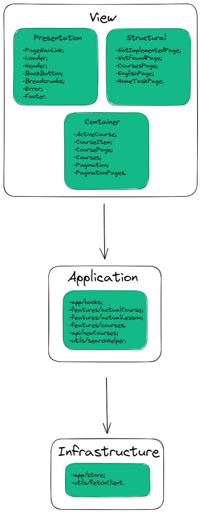

# Layers
### Layers schema

## I distinguish my project into the 3 following layers:
- View;
- Application;
- Infrastructure.

### View components are divided to:

- presentation sublayer;
- structural sublayer; are responsible for the structure, do not receive anything and do not know about Api and store (App, Loader, NotFoundPage).
- container sublayer. communicates with Application, Api and store.

Presentation sublayer: This layer contains simple components that accept data and have no business logic, no access to the Redux store and API. Can easily be reused elsewhere.
Structural sublayer: This layer includes such components as pages. They also accept data and have no business logic and no access to Redux store and API. They have responsible for the structure.
Container sublayer: This layer interacts with the API and the Redux stote. He interacts with Application layer using hooks.

### The Application layer

This layer includes hooks that establish communication between View Layer and Infrastruture Layer.

### The Infrastructure layer.

This layer is responsible for interacting with the server and saving data to the local storage and Redux store.
